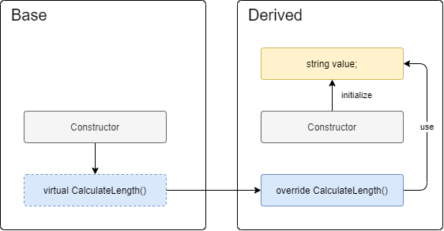

# Virtual in Constructor

## Question

If we call a virtual method from the constructor, Resharper raises a warning:


Same warning is raised if we call an abstract method and also if we call a virtual or abstract property.

In this article I'll try to explain why is it a problem to call virtual or abstract methods or properties from the constructor?

## The problem

### `Base` class

Let's have a simple class called `Base` that will call a virtual method, `CalculateLength` from its constructor.

```csharp
internal class Base
{
    public int Length { get; }

    protected Base()
    {
        Length = CalculateLength();
    }

    protected virtual int CalculateLength()
    {
        return 0;
    }
}
```

### `Derived` class

Now, imagine that we derive from this class and, in the derived class, we do two important things:

1) **Initialize a field** - In the constructor we initialize a read-only nullable field with a non-null value. This will ensure that the field will never be null, yes?
2) **Use it in the overwritten virtual method** - Overwrite the `CalculateLength` virtual method and return the length of that string field.

```csharp
    internal class Derived : Base
    {
        private readonly string value;

        public Derived(string value)
        {
            this.value = value ?? throw new ArgumentNullException(nameof(value));
        }

        protected override int CalculateLength()
        {
            return value.Length;
        }
    }
```

Surprisingly, a `NullReferenceException` will be thrown, even if the field can never be null... or can it?

## How is this possible?

Because of the order in which the constructors are called we have the following sequence of events:

- **Step 1** - First, the base constructor is called.

  

- **Step 2** - The base constructor calls the virtual method, but, because it is overwritten in the derived class, the overwrite method is called instead.

  

- **Step 3** - The virtual method uses the uninitialized field, but, at this point, it was not yet initialized by the derived constructor, because it didn't get the chance to be executed yet. So, a `NullReferenceException` is thrown.

  

- **Step 4** - If it gets the chance (no exception is thrown by the virtual method), the derived constructor is called that will initialize the field.

  

## Conclusion

So, the problem comes from the fact that, in the derived class,  the overwritten virtual `CalculateLength` is executed before the constructor gets the chance to initialize the fields.

**Note**: Same problem happens with an abstract methods or called from the constructor. And also with abstract or virtual properties.
